# 路由服务器 Gateway
[jm-gateway] (https://github.com/jm-root/jm-gateway)

- 简介
- 配置

## 简介

Gateway负责转发请求到对应的微服务，其工作流程如下图：



### 1 启动

1. Gateway服务器启动时，会读取Config服务器的模块配置，并完成初始化工作。

### 2 用户登陆

- 2.1 对于用户的登陆请求，Gateway直接路由给Passport服务。
- 2.2 Passport完成验证。
- 2.3 Passport验证成功后，调用SSO服务，生成令牌Token，并返回给客户端，后续用户所有其他请求都需要附带此Token，从而Gateway可以识别用户身份。

### 3 用户请求

- 3.1 用户发起请求，请求中附加了token信息，例如http://xxx.com/sso/user?token=xxxx
- 3.2 Gateway调用SSO服务，判断用户是否登陆，如果用户已登陆，Gateway会把用户信息保存在请求参数opts中opts.user中。
- 3.3 Gateway调用ACL服务，判断当前用户对于当前请求资源是否有权限，如果没有，返回无权限的错误，否则Gateway会把用户id保存在请求参数opts.data.acl_user中。
- 3.4 如果鉴权成功，Gateway调用目标服务，并返回结果给客户端。

## 配置

基本配置 请参考 [Server](#docs/server)

| 配置项 | 默认值 | 描述(desc) |
| :-: | :-: | :-: |
|config_root_server|gateway|Config服务器root
|disableSSO|false|是否禁止SSO插件, 默认不禁止, 判断是否登录用户
|disableACL|false|是否禁止ACL插件, 默认不禁止, 判断是否允许访问

```
// config服务器配置示例
{
    "modules":{
        "config":{
            "proxy":"http://config.app.rancher.internal/config"
        },
        "acl":{
            "proxy":"http://acl.app.rancher.internal/acl"
        },
        "sso":{
            "proxy":"http://sso.app.rancher.internal/sso"
        },
        "passport":{
            "proxy":"http://passport.app.rancher.internal"
        },
        "captcha":{
            "proxy":"http://captcha.app.rancher.internal/captcha"
        },
        "sms":{
            "proxy":"http://sms.app.rancher.internal/sms"
        },
        "verifycode":{
            "proxy":"http://verifycode.app.rancher.internal/verifycode"
        },
        "users":{
            "proxy":"http://user.app.rancher.internal/users"
        }
    }
}
```
