# 简介

## 概述

JM 是一组开源项目的集合。它的目标，是用来快速开发和部署基于微服务架构的应用程序。

## 约定

首字母大写为类或者常量，小写为函数、对象或者变量，类名首字母小写为实例化该类的函数。

## 典型微服务架构方案

网关服务 gateway 负责转发请求到对应的微服务，配置服务config完成统一配置，通行证服务 passport 负责用户注册登陆，单点登陆服务 sso 负责令牌 token 的创建和管理，鉴权服务 acl 负责权限控制。

所有服务都基于微服务框架 jm-server 实现。

jm-server 是一个微服务框架，帮助开发者把精力集中在应用层面的服务 service、控制器 controller 及路由 router 的开发，而不必关注底层的实现。特别的，由于 jm-server 采用了模块化设计，开发者可以把多个微服务集中在一个 jm-server 中作为单体应用部署，这样可以兼容传统的软件开发模式，更加灵活。

jm-ms 作为 JM 微服务架构的核心模块，提供一种新的路由定义方式，定义一次可以支持多种通讯协议，例如 Http，Websocket 甚至 UDP 等等，这带来的好处是部署时更加灵活，例如对于最终用户提供 Http 协议，而对于微服务之间的通讯采用更加高效的 Websocket 协议或者 UDP 协议。

jm-module 提供模块化支持。

jm-event 提供一个通用的轻量级的事件机制。

jm-logger 提供日志服务。

jm-err 定义了常用的错误。

这几个基础库都包含在核心库 Core 中。

## 框架包含的开源项目

### 微服务框架

1. [基础库 core](https://github.com/jm-root/core)

1. [微服务 ms](https://github.com/jm-root/ms)

1. [微服务器 server](https://github.com/jm-root/server)

### 微服务应用

1. [微服务器模板 server template](https://github.com/jm-root/server-template)

1. [网关服务 gateway](https://github.com/jm-root/gateway)

1. [配置服务 config](https://github.com/jm-root/jm-config)

1. [单点登陆服务 sso](https://github.com/jm-root/jm-sso)

1. [鉴权服务 acl](https://github.com/jm-root/acl)

1. [通行证服务 passport](https://github.com/jm-root/passport)

1. [用户服务 user](https://github.com/jm-root/user)

1. [消息服务 mq](https://github.com/jm-root/mq)
