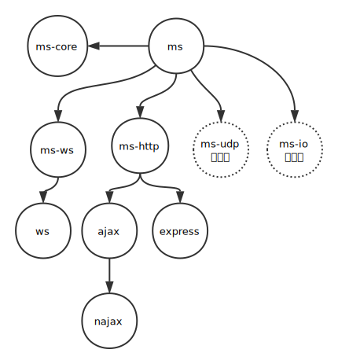

# 微服务 MS
[jm-ms] (https://github.com/jm-root/jm-ms)

- 为什么
- 简介
- ms-core

## 为什么

微服务的接口一般被设计成标准的RESTful，支持标准的Http协议，底层实现上可选框架包括Express，Koa等等，很简单，也很好用。

但是，实际项目中，我遇到了很多Http协议处理不好的问题。

- 客户端需要长连接时，需要考虑Websocket协议。
- 微服务之间通讯时，采用TCP或者UDP协议，性能通常可以提高75%以上。
- 有时候我需要做带业务逻辑的proxy转发，用nginx实现不了，比如实现一个路由，先鉴权再转发相应请求到目标微服务上。

如果开发者已经基于express实现了接口，现在我想支持UDP协议，我必须基于新的协议对于接口重新设计和实现，这会浪费很多宝贵的时间。

所以我设计了jm-ms，很好的解决了这些问题。

## 简介



## ms-core
ms-core是ms的核心，下面用代码例子描述其主要功能。
```
// 定义一个函数
function hello(opts, cb) {
    cb(null, {ret: opts.data.msg});
}

// 定义一个回调函数
function cb(err, doc) {
    console.log(doc.ret);
}

// 直接调用
hello({data: { msg: 'hello'}}, cb);

// 定义一个服务，包含两个函数
var service = {
    hello: hello,
    hello2: hello
}

// 调用服务
service.hello({data: { msg: 'hello'}}, cb);
service.hello2({data: { msg: 'hello'}}, cb);

// ms-core 希望开发者可以这样调用服务
var data = {msg: 'hello'};
router.request('/hello', 'get', data, cb); // service.hello({data: data}, cb);
router.get('/hello2', data, cb); // service.hello2({data: data}, cb);
// 以及这样调用
router.request({uri: '/hello', type: 'get', data: data}, cb);
```

为此ms-core定义了路由器Router。

### router
代表一个路由器，可以为一个路由器定义一条以上的路由规则，这些规则统一构成路由器的路由表。

```
// 引入
var MS = require('jm-ms-core');

// 定义一个函数
function hello(opts, cb) {
    cb(null, {ret: opts.data.msg});
}

// 定义一个回调函数
function cb(err, doc) {
    console.log(doc.ret);
}

// 定义一个服务，包含两个函数
var service = {
    hello: hello,
    hello2: hello
}

// 创建一个路由器
var ms = new MS();
var router = ms.router();

// 为路由器添加路由规则,支持多种方式,支持链式
router
    .add('/hello', 'get', service.hello)
    .add({uri: '/hello2', type: 'get', fn: service.hello2})
    .use('/hello3', service.hello);
    .use({uri: '/hello4', fn: service.hello})
;
// add 和 use的区别是add可以加请求类型， use不可以
// use可以添加另外一个router作为子路由，例如 router.use(router2)

// 通过路由器发起请求
var data = {msg: 'hello'};
router.request('/hello', 'get', data, cb);
router.get('/hello', data, cb);

```

### server
### client
### proxy
