# 通用服务器 Server
[jm-server] (https://github.com/jm-root/jm-server)

- 引入
- 简介
- 模块化
- 配置

## 引入

```
npm install -g jm-server

jm-server -h
// 或者
jms -h
```

## 简介
采用微服务架构的一个典型特点就是，把传统的大规模应用拆分为很多个独立的小的应用，每个小应用麻雀虽小，五脏俱全。

一个独立的应用一般会包含配置、通讯、日志和一些公共服务，每个小应用都重复去实现这些部分没有必要，而且也不利于以后的维护和扩展。

为了很好的解决这个问题，我设计了jm-server。

jm-server是一个通用服务器框架，帮助开发者把精力集中在应用层面的服务及路由的开发，而不必关注底层的实现。特别的，由于jm-server采用了模块化设计，开发者可以灵活的把多个微服务集中在一个jm-server中部署，这样可以兼容传统的软件开发模式，更加灵活。

jm-server基于jm-ms实现，其主要功能如下图蓝色框部分所示。



## 模块化

开发者的任务是为jm-server开发模块，每个模块包含两个基本部分，服务和路由，其中路由是可选的，jm-server在加载模块时，会检查模块中是否有定义路由，如果定义了就自动启用。

两个简单例子：

```
// 模块例子，无路由
module.exports = function(opts) {
    var service = {
        version: '1.0.0',

        hello: function() {
            return 'hello';
        }
    };
    return service;
}
```

```
// 模块例子, 有路由

var MS = require('jm-ms-core');
var ms = new MS();

// 定义router
var router = function () {
    var service = this; // 这里通过this可以获得service示例
    var router = ms.router();

    // 定义一条路由
    router.add('/help', 'get', function(opts, cb){
        cb(null, {
                version: service.version,
                hello: service.hello()
        });
    });

    return router;
};

module.exports = function(opts) {
    var service = {
        version: '1.0.0',

        hello: function() {
            return 'hello';
        }
    };

    //router 可选
    service.router = router;

    return service;
}
```

## 配置

jm-server的配置参数支持2种方式。

- 通过配置文件 config/index.js。
- 通过环境变量，主要是为了方便Docker化部署。

注意：maxcpus只能通过环境变量传入。

| 配置项 | 默认值 | 描述(desc) |
| :-: | :-: | :-: |
|debug|false|是否打开调试模式
|port|3000|监听端口
|host|'0.0.0.0'|监听的IP地址
|prefix||Uri前缀
|trustProxy|false|是否传递IP地址
|lng||语言
|maxcpus||cluster模式的最多cpu数量, 默认全部

```javascript
// config/index.js
var config = {
    development: {
        // ....
        modules: {   // 模块
            '': // key， 模块唯一标识
            {
                module: 'jm-ms-message', // 可选，模块名或者模块路径
                                         // 默认未key，必须要能够require到
                prefix: '', // 可选 uri prefix 默认为key
                config: {}  // 可选 模块配置, 默认采用全局配置
            },
            oms: {
                proxy: 'http://localhost:20170/oms'
                        // proxy指令, 把对于模块的请求转发到指定URI
            },
            config: {
                module: 'jm-config'
            }
        }
    },
    production: {
        port: 21000
    }
};
```